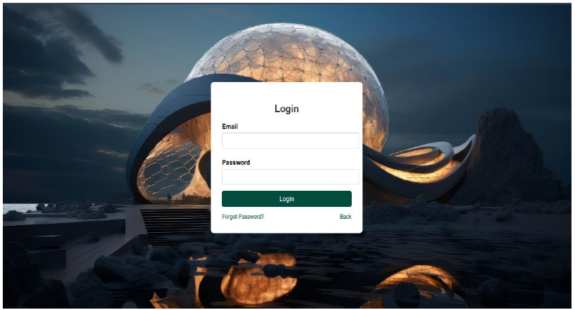
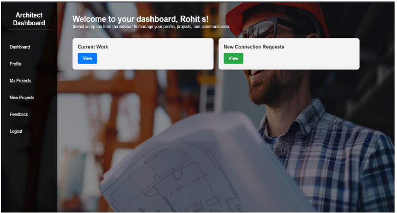

# ArchiSphere – Architect Finder Web Application

## Overview
ArchiSphere is a web-based platform designed to connect users seeking architectural services with professional architects. The system provides a structured and interactive environment where users can explore architect profiles, review past projects, and send personalized project requests.

Architects can manage their profiles, showcase their work, respond to client requests, and update project status through a dedicated dashboard.

---

## Problem Statement
Finding reliable and suitable architects for construction or renovation projects can be time-consuming and unorganized. ArchiSphere solves this problem by providing a centralized digital platform that streamlines discovery, communication, and project management between users and architects.

---

## User Roles

### User
- Register and login securely
- Browse architect profiles
- View completed projects and portfolios
- Send project connection requests
- Track project progress
- Leave feedback after project completion

### Architect
- Manage personal profile
- Showcase completed projects with images and descriptions
- View and respond to incoming project requests
- Accept or reject client requests
- Update project status throughout its lifecycle

---

## Workflow Overview
1. User registers and logs into the system.
2. User browses architect profiles and sends a project request.
3. Architect reviews the request and accepts or rejects it.
4. If accepted, the architect updates the project status as work progresses.
5. Upon project completion, the user provides feedback.
6. All data is securely stored and managed through the backend database.

---

## Tech Stack
- **Frontend:** HTML, CSS, JavaScript
- **Backend:** PHP
- **Database:** MySQL
- **Architecture:** Client-Server Model

---

##  Security Features
- Secure user authentication
- Role-based access control
- Input validation
- Structured relational database management

---

##  Key Features
- Interactive and user-friendly interface
- Architect portfolio management
- Project request and status tracking system
- Feedback and credibility enhancement system
- Efficient database handling using PHP & MySQL

---

##  Future Enhancements
- Online payment integration
- Real-time chat between users and architects
- Rating & review analytics
- AI-based architect recommendations
- Mobile responsive optimization

---

##  Screenshots
## 📸 Screenshots

### 🏠 Home Page

### 🔐 Login Page

### 👤 User Dashboard

### 🏢 Architect Dashboard

---

